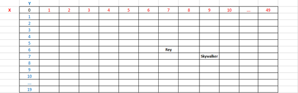

# Desafio 01: O Despertar da Força

## Peso:

3 pontos

## Objetivo:

Escrever uma função para permitir que Rey alcance seu mestre Luke Skywalker no planeta Ahch-To.

## Regras:

Rey se move em um mapa com 50 de largura por 20 de altura. Observe que as coordenadas (X e Y) começam no canto superior esquerdo! Isso significa que a célula superior esquerda possui as coordenadas "X = 0, Y = 0" e a célula inferior direita tem as coordenadas "X = 49, Y = 19".

A função deverá receber como parâmetro:

- a variável skywalkerX do tipo inteiro => a posição X de Luke Skywalker que Rey deve alcançar.
- a variável skywalkerY do tipo inteiro => a posição Y de Luke Skywalker que Rey deve alcançar.
- a variável reyX do tipo inteiro => a posição X inicial de Rey.
- a variável reyY do tipo inteiro => a posição Y inicial de Rey.

No final do turno do jogo, você deve exibir um array de Strings com as direções na qual Rey deve seguir para alcançar seu mestre, utilizando a menor quantidade de interações (passos/direções) possível. As direções são dadas da seguinte forma:


|     |            |
| --- | ---------- |
| N   | North      |
| NE  | North-East |
| E   | East       |
| SE  | South-East |
| S   | South      |
| SW  | South-West |
| W   | West       |
| NW  | North-West |

Cada movimento faz a Rey se mover por 1 célula na direção escolhida.

### Exemplo:

```
Dado que Rey está na posição (X = 7 e Y = 6) e Luke Skywalker está na posição (X = 9 e Y = 7).
O resultado esperado deverá ser um array de strings com os seguintes valores [ ‘SE’, ’E’ ].
```



# Desafio 02: O Mapa Binário

## Peso:

3 pontos

## Objetivo:

Escrever uma função que, dado um número inteiro positivo N, retorna o comprimento de seu intervalo binário mais longo. A função deve retornar 0 se N não contiver um intervalo binário.

## Regras:

Um intervalo binário dentro de um inteiro positivo N é qualquer sequência máxima de 0 (zeros) consecutivos que é cercada por 1 (um) em ambas as extremidades na representação binária de N.

Por exemplo, o número 17 tem representação binária 10001 e contém um intervalo binário de comprimento 3. O número 137 tem representação binária 10001001 e contém dois intervalos binários: um de comprimento 3 e um de comprimento 2. O número 40 tem representação binária 101000 e contém um intervalo binário de comprimento 1. O número 7 tem representação binária 111 e não possui intervalo binários.

Assuma que N é um número inteiro maior que 0 (zero).

O cálculo para descobrir a representação binária deverá ser feito em código sem a utilização de bibliotecas e ou funções existentes (que já implementem este cálculo). Em outras palavras, você deverá criar o algoritmo para calcular a representação binária de um número inteiro positivo.

### Exemplo:

```
Dado N = 537, a função deve retornar 4, porque N possui uma representação binária 1000011001 e, portanto, o intervalo binário mais longo é de comprimento 4.
```

# Desafio 03: Relatório para Diretoria

## Peso:

5 pontos

## Objetivo:

Escrever uma função que gere um relatório em arquivo texto com todos os departamentos da empresa Coding is The Future e seus respectivos dados gerenciais.

## Regras:

A função desenvolvida deverá receber como parâmetro o caminho para dois arquivos com os dados da instituição, conforme abaixo:

| Parâmetro                  | Tipo   | Descrição                                                                                                       |
| -------------------------- | ------ | --------------------------------------------------------------------------------------------------------------- |
| caminhoArquivoDepartamento | String | Neste parâmetro, será informado o caminho completo do arquivo que contém os dados dos departamentos da empresa. |
| caminhoArquivoFuncionarios | String | Neste parâmetro, será informado o caminho completo do arquivo que contém os dados dos funcionários da empresa.  |

### Estrutura do arquivo de Departamentos:

O arquivo de departamentos é um arquivo em formato texto, onde seus valores são separados por ponto e vírgula ( ; ). A primeira linha do arquivo contém o nome das colunas.

#### Dados:

| Campo | Tipo    | Descrição            |
| ----- | ------- | -------------------- |
| Id    | Inteiro | Id do departamento   |
| Nome  | String  | Nome do departamento |

#### Exemplo:

[departamentos.txt](files/departamentos.txt)

### Estrutura do arquivo de Funcionários:

O arquivo de funcionários é um arquivo em formato texto, onde seus valores são separados por ponto e vírgula ( ; ). A primeira linha do arquivo contém o nome das colunas.

#### Dados:

| Campo          | Tipo    | Descrição                                               |
| -------------- | ------- | ------------------------------------------------------- |
| Id             | Inteiro | Código do funcionário                                   |
| Nome           | String  | Nome do funcionário                                     |
| Salario        | Inteiro | Salário do funcionário                                  |
| IdDepartamento | Inteiro | Código do departamento ao qual o funcionário faz parte. |

#### Exemplo:

[funcionarios.txt](files/funcionarios.txt)

**A função deverá ler os arquivos mencionados anteriormente e gerar um novo arquivo com as seguintes especificações:**

O arquivo gerado deverá ser um arquivo em formato texto, onde seus valores são separados por ponto e vírgula ( ; ). A primeira linha do arquivo contém o nome das colunas.
Este arquivo deverá ser salvo com o nome resultado.txt na em qualquer diretório da máquina corrente.

#### Dados:

| Campo                  | Tipo     | Descrição                                                                                             |
| ---------------------- | -------- | ----------------------------------------------------------------------------------------------------- |
| DataHora               | DataHora | Esta campo deverá conter a data e a hora da consulta no seguinte formato YYYYMMDD HHMISS <sup>1</sup> |
| IdDepartamento         | Inteiro  | Código do departamento                                                                                |
| NomeDepartamento       | String   | Nome do departamento                                                                                  |
| QuantidadeFuncionarios | Inteiro  | Quantidade de funcionários que pertencem ao departamento em questão.                                  |
| MenorSalario           | Inteiro  | Menor salário do departamento. Caso o departamento não possuir funcionários, informar 0 ou nulo.      |
| MaiorSalario           | Inteiro  | Maior salário do departamento. Caso o departamento não possuir funcionários, informar 0 ou nulo.      |
| MediaSalario           | Inteiro  | Média de salário do departamento. Caso o departamento não possuir funcionários, informar 0 ou nulo.   |

<sup>1</sup> Formato DataHora

```
YYYY – ano com 4 dígitos
MM – mês com 2 dígitos
DD – dia com 2 dígitos

HH – horas com 2 dígitos
MI – minutos com 2 dígitos
SS – segundos com 2 dígitos
```

#### Exemplo de arquivo gerado:

[resultado.txt](files/resultado.txt)
